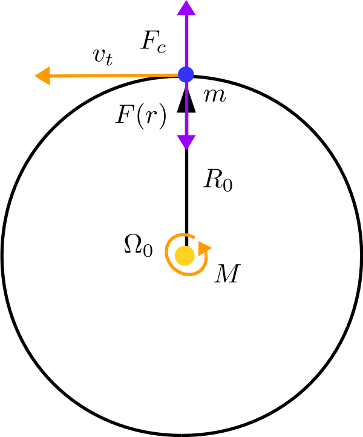
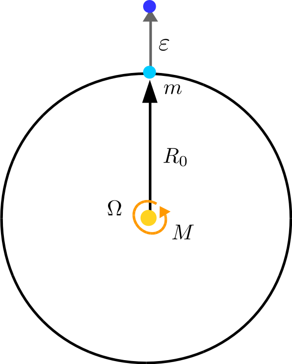
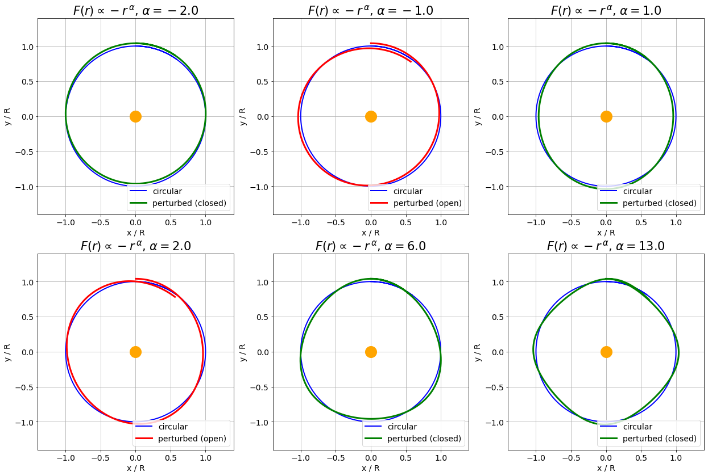

# Perturbing circular orbits and General Relativity
### The closure of near-circular orbits and the relativistic precession of Mercury's perihelion using high school math

### Stanislav Fort ([Twitter](https://twitter.com/stanislavfort) and [GitHub](https://github.com/stanislavfort))

## Table of contents
1. [Introduction](#introduction)
2. [Setting up the problem](#setup)
3. [Perturbing the circular orbit](#perturbing)
4. [The harmonic oscillator hidden there](#harmonic)
5. [Closure of power-law force orbits](#closure)
6. [Slight modification of Newton's gravity](#modification)
7. [General Relativity made simple](#GR)
8. [Stability and existence of orbits around black holes](#stability)
9. [(Optional nitpicking)](#nitpick)

## 1. Introduction 
When I was diving into physics high school, I was always puzzled by the fact that in [Newton's theory of gravitation](https://en.wikipedia.org/wiki/Newton%27s_law_of_universal_gravitation), the orbits of small test bodies that were gravitationally bound to a much more massive, central body would generically be *closed*, i.e. the trajectory would wrap back around onto itself after each revolution around the central body. After all, I could very much imagine a situation where the Earth would not return *exactly* to the same position after a full orbit around the Sun.

I knew about the existence of the [precession of the orbit of Mercury](https://en.wikipedia.org/wiki/Tests_of_general_relativity#Perihelion_precession_of_Mercury) and the crucial role it played in the verification of [Einstein's General Theory of Relativity](https://en.wikipedia.org/wiki/General_relativity). In Einstein's General Relativity, the orbit of Mercury would not close back onto itself after an orbit around the Sun (though by a very miniscule amount), while in Newton's gravity (without the influence of other planets), it would. What was the reason behind that and could I possibly get to the crucial difference between the two theories responsible for this?

While General Theory of Relativity rightly deserves its reputation of impenetrability, many of its *concrete conclusions* are surprisingly simple. However, these simple nuggets are often presented in a manner that I would not have been able to digest back during my high school days, or well hidden in graduate-level textbooks. In this post, I will use the unexpectedly simple correction to Newton's law of gravitation that General Relativity predicts for small bodies orbiting non-rotating, non-charged central massive bodies. Using that, I will **1) derive the precession of the orbit of Mercury** using only high school mathematics, and **2) build a general argument for either the openness, or closure of near-circular orbits** under the influence of various force laws.    

## 2. Setting up the problem 
Let us imagine a two-dimensional Cartesian coordinate system, with a very massive body of mass $M$ at the origin, and a much lighter body of mass $m$ ($m \ll M$) at distance $R$ from the origin. We will be studying the orbits of the small test body around the massive central body under the influence of different attractive forces, which will always be pointing from the small body *towards* the large body in terms of their direction. To further simplify the problem, we will assume that the heavy central body is *static* (i.e. that it does not move at all as a reaction to the small body).

### 2.1 Circular orbit
Let us call $F(r)$ the attractive force pulling the small test body $m$ to the large body $M$. We will assume throughout this post that its magnitude depends only on the distance from the origin (and therefore the central body) $r$. Furthermore, its vector always points *towards* from the origin, i.e. in the $-\hat{r}$ direction, aligned with the vector from the test body to the central body. Since the direction of increasing $r$ points in the opposite direction, the force $F(r)$ will have a negative sign.

For any attractive force $F(r)$ and for any radius of our choosing $R_0$, there will always exist an angular velocity $\Omega$ (specifying the angle per unit time swept by the vector $\vec{r}$) of a circular orbit at that radius. This is due to the fact that the [centrifugal force](https://en.wikipedia.org/wiki/Centrifugal_force) pointing away from the origin in the direction $\hat{r}$ will, for some value of $\Omega_0$, exactly balance the attractive force $F(R_0)$.

Of course, centrifugal force is in a sense *not real*. In this treatment, we will be studying the evolution of the radius as a function of time $R(t)$, and it will therefore be advantageous to stay in the coordinate frame connected with the test body. Due to that [frame of reference]("https://en.wikipedia.org/wiki/Frame_of_reference") being [non-inertial](https://en.wikipedia.org/wiki/Non-inertial_reference_frame), the centrifugal force will appear.

The centrifugal force is $F_c(r) = \Omega^2 m r$ for a body of mass $m$ moving with angular velocity $\Omega$ at radius $r$ from the origin. Understanding that the actual, linear tangential velocity is $v_t = \Omega r$, we recover the familiar form $F_c(r) = m v_t^2 / r$, however, the angular form will be easier to work with later. The circular orbit therefore has to satisfy the balance of the attractive force $F(R_0)$ and the centrifugal force $F_c(R_0, \Omega_0)$ as
$F(R_0) + \Omega_0^2 R_0 m = 0 \, .$

### 2.2 Power-law attractive force
While correct, the setup above is too general to be very instructive. Let us now consider a particular kind of force laws which depend on the radius $r$ with a particular power $\alpha$. Such a force law could generally be written as
[%
F_{\alpha}(r) = - C m r^{\alpha} \, ,
%]
where $C$ is a constant that does *not* depend on either $r$ or $m$. I decided to single out $m$ -- the mass of the test body -- for later convenience.

We have readily available two examples of such a force law:
1) **The spring force** (also known as the [Hooke's law](https://en.wikipedia.org/wiki/Hooke%27s_law)) $F(r) = - k r$, where $k$ is the stiffness of the spring and $r$ is its extent. Here, $\alpha = 1$.
2) **Newton's gravitational law** $F(r) = - G \frac{M m}{r^2}$, where $G$ is the gravitational constant, $M$ is the mass of the central body, $m$ is the mass of the test body, and $r$ is the distance of the test body from the central body. Here, $\alpha = -2$.

For the spring law, we get $C = k/m$ and $\alpha = 1$, while for Newton's gravitational law, we get $C = G M$ and $\alpha = -2$. These two values will prove very special. In fact, for a power-law force with power $\alpha$, those two values will lead to *closed bound orbits* even for *arbitrarily large deviations* from the circular orbit. Our analyses in this article deal with *small* deviations from the circular trajectory, and the closure / openness of orbits we derive is conditional upon that assumption. However, for $F \propto  1/r^2$ and $F \propto r$ these deviations can be arbitrarily large.

What would the circular orbit parameters be for the power-law force? Let's just plug the force law into the balance of forces from which we derive
[%
\Omega_0^2 = C R_0^{\alpha - 1} \, .
%]

### 2.3 Angular momentum
We will need to use the [angular momentum](https://en.wikipedia.org/wiki/Angular_momentum) $L$ in later calculations, which we can obtain as $L = v_t m r$, where $v_t$ is the tangential component of the velocity of the body of mass $m$ to the direction $\hat{r}$, and $r$ is its distance from the origin. Since $v_t = \Omega r$, we get
[%
L = \Omega r^2 m \, .
%]
For the circular trajectories and the power-law force, this gives us $L = \sqrt{C} R_0^{\alpha / 2 + 3/2} m$.

## 3. Perturbing the circular orbit 

### 3.1 Giving the orbit a small kick

Imagine a nice, circular trajectory of radius $R_0$ orbiting with the appropriate angular velocity $\Omega_0$. Let's focus on the power-law attractive force for now and generalize the result later.

Imagine giving the small body of mass $m$ **a little kick** to a slightly higher radius. Speaking exactly, let the radius now be $R = R_0 + \varepsilon$. Let's assume that the radius perturbation $\varepsilon$ is *small* and let's also assume that the angular momentum $L$ of the trajectory remains unchanged by this perturbation, i.e. it stays at the value of $L = \Omega_0 R_0^2 m$. We are keeping the angular momentum the same in order to able to compare the original circular orbit to the new, perturbed orbit. You can find a [more detailed argument]("#Lconstant") in the last section.

What is now the force acting on the perturbed test mass? The attractive force changed from $F(R_0)$ to $F(R_0 + \varepsilon)$. The centrifugal force, on the other hand, changed *both* as a consequence of the radius changing and the velocity changing due to the angular momentum $L$ being kept constant.

To preserve the angular momentum at this new radius $R = R_0 + \varepsilon$, we also need to change the angular velocity from $\Omega_0$ to $\Omega$. Comparing the two angular momenta, we get
[%
\Omega_0 R_0^2 m = \Omega R^2 m \, .
%]
The new angular velocity is therefore $\Omega = \Omega_0 \frac{R_0^2}{R^2}$. The centrifugal force is then
[%
F_c(R) = \Omega_0^2 \frac{R_0^4}{R^4} R m = \Omega_0^2 R_0 m \frac{R_0^3}{R^3} \, .
%]

You might wonder where the [Coriolis force](https://en.wikipedia.org/wiki/Coriolis_force) went. After all, we are in a non-inertial frame of reference. Shouldn't it appear as an additional force term? It turns out that we already absorbed its effect in $\Omega = \Omega_0 \frac{R_0^2}{R^2}$. The Coriolis force would lead to a tangential acceleration changing the tangential velocity of the test particle, which is exactly what we are capturing by expressing the dependence of the angular velocity on radius $\Omega(R)$.

You might also wonder whether there would be angular perturbations, equivalent to the radial perturbation $\varepsilon$, and what their effect would be. I address this in the [optional bonus section](#angularperturbation) at the end of this article. It turns out that we can safely ignore them in our analysis.

### 3.2 A little mathematical trick
What we would *actually* need to use here is a derivative. However, as I promised, this derivation will be accessible to high school students, and while some high schools do indeed cover calculus, many do not. I will therefore use a small trick that will do for this purpose.

Let's suppose that we have an expression of the form $(1+x)^n$, where $|x| \ll 1$. Using [the binomial expansion](https://en.wikipedia.org/wiki/Binomial_theorem), or simply multiplying the expression out, we notice that it expands to
[%
(1+x)^n = 1 + nx + \frac{n(n-1)}{2} x^2 + \frac{n(n-1)(n-2)}{6} x^3 + \dots \, .
%]
Notice the way I sorted the terms of the expansion -- by the increasing powers of $x$. The higher the power of $x$, the smaller its value (owing to the small size of $|x|$). If we either do not care about the *precise* value of $(1+x)^n$ or we will eventually take $x \to 0$, **keeping only the first two terms** will suffice, i.e.
[%
(1+x)^n \approx 1 + nx \, .
%]
This also holds for *non-integer values of $n$*, and will roughly hold until $n |x| \approx 1$. We will make a heavy use of this expansion in our derivations. Notice that we had to assume the small size of $|x|$. Our follow-up analyses will therefore suffer the same restriction -- they will only be precise as long as the equivalent of $|x|$ is small.

### 3.3 Small changes in forces
Let us go back to the power-law attractive force $F(r) = - C m r^{\alpha}$. The attractive force at radius $R = R_0 + \varepsilon$ is $F(R_0 + \varepsilon) = - C m (R_0 + \varepsilon)^{\alpha}$. This is suspiciously similar to the mathematical expansion we derived above, and after a small change into $- C m R_0^\alpha (1 + \varepsilon / R_0)^{\alpha}$, this is *exactly* the right form. Since we assume $\varepsilon$ to be small compared to $R_0$, we can expand the bracket approximately as
[%
F(R_0 + \varepsilon) \approx - C m R_0^{\alpha} (1 + \alpha \varepsilon / R_0) \, .
%]

How does the centrifugal force change? As derived before, we have the new force
[%
F_c(R_0 + \varepsilon) = \Omega_0^2 R_0 m \frac{R_0^3}{(R_0 + \varepsilon)^3} = \Omega_0^2 R_0 m \frac{R_0^3}{R_0^3 (1 + \varepsilon/R_0)^3} \, .
%]
Using the same trick, we get
[%
F_c(R_0 + \varepsilon) = \Omega_0^2 R_0 m (1 + \varepsilon/R_0)^{-3} \approx \Omega_0^2 R_0 m (1 - 3 \varepsilon/R_0)  \, .
%]

While for the circular trajectory the net force on the test mass was $0$ (the gravitational force and centrifugal force were exactly balanced), the small kick $\varepsilon$ introduced a mismatch between these two forces. The total force $F_t(\varepsilon)$ is
[%
F_t ( \varepsilon ) \approx \Omega_0^2 R_0 m (1 - 3 \varepsilon / R_0) - C m R_0^{\alpha} (1 + \alpha \varepsilon / R_0) \, .  
%]

From the derivation of the circular orbit, we know that $\Omega_0^2 R_0 m = C m R_0^\alpha$. We therefore get
[%
F_t ( \varepsilon ) \approx - \varepsilon (3 + \alpha ) \Omega_0^2 m \, .  
%]

This is a very simple result! By pushing the radius of the circular orbit to a higher orbit by $\varepsilon$, there is an effective force pulling it back to the circular radius, and the force depends *linearly* on the amount by which we change the radius! This is a hallmark of a class of problems that are in fact very easy to solve -- the harmonic oscillator.

## 4. The harmonic oscillator hidden there 
By changing the radius of the orbit by $\varepsilon$, the test mass $m$ will be pulled back to the original radius by the force $F_t(\varepsilon) \propto - (3 + \alpha) \varepsilon$. Notice that force depends linearly on the radius change $\varepsilon$. The total acceleration $a_t = F_t / m$ is therefore
[%
a_t(\varepsilon) = -(3+\alpha) \Omega_0^2 \varepsilon \, .
%]

The [harmonic oscillator](https://en.wikipedia.org/wiki/Harmonic_oscillator) with the equation of motion $\ddot{x} + \omega^2 x = 0$ (where $\ddot{x}$ is simply the acceleration) has the solution composed of sines and cosines of frequency $\omega$. The value of $x$ will therefore change up and down with the perion $2 \pi / \omega$.

This is great, because our equation is *exactly* of this form. The acceleration is $-(3+\alpha) \Omega_0^2 \varepsilon$, and therefore $\ddot{\varepsilon} + (3+\alpha) \Omega_0^2 \varepsilon = 0$. We can identify the $\omega^2 = (3+\alpha) \Omega_0^2$. Therefore
[%
\boxed{\omega = \sqrt{ \left ( 3 + \alpha \right ) } \, \Omega_0} \, .
%]
In words, the radius perturbation $\varepsilon$ around the circular orbit with the orbital velocity $\Omega_0$ will be oscillating around the original orbital radius up and down with frequency $\omega = \sqrt{ \left ( 3 + \alpha \right ) } \, \Omega_0$.

## 5. Closure of power-law force orbits 
What does it mean for an orbit to be closed? An orbit is closed if, during a single journey around the central body, there is an *integer number of oscillations* of radius about the circular radius. We therefore want $\sqrt{3 + \alpha}$ to be an integer $n$.

For the negative values of $\alpha$, the only such value is $\alpha = -2$, for which we obtain $\omega = \Omega_0$. This is **exactly Newton's gravitational law**! For positive values of $\alpha$, we have a whole spectrum of possible values of $\alpha$, starting with $\alpha = 1$, for which we obtain $\omega = 2 \Omega_0$. This is precisely the **Hook's law**, or the harmonic oscillator. The next smallest value would be $\alpha = 6$, for which we would get $\omega = 3 \Omega_0$, followed by $\alpha = 13$ with $\omega = 4 \Omega_0$. To visualize this result, I numerically simulated orbits for 6 different values of $\alpha$, including two open orbits.

## 6. Slight modification of Newton's gravity 
From astronomical observations, we have known for a long time that orbits of planets are not *exactly* closed. They precess with time. The bulk of this precession can be explained by the influence of other planets, however, there is [a part](https://en.wikipedia.org/wiki/Tests_of_general_relativity#Perihelion_precession_of_Mercury) that cannot be accounted for within Newton's gravitational law $F = - GMm/r^2$.

A possible explanation could be that the gravitational force does not depend *exactly* on the square of the distance, but perhaps on a slightly different power. Imagine that the law would in fact be $\delta$ far away from the second power, i.e. $\alpha = -2 + \delta$. Using our calculation above, we know that the perturbations around the circular orbit would happen with frequency $\omega = \sqrt{3 - 2 + \delta} \, \Omega_0 = \sqrt{1 + \delta} \, \Omega_0$.

The precession of the perihelion of Mercury that is unaccounted for by the influence of other planets is [42.9799 arcseconds per century](https://en.wikipedia.org/wiki/Tests_of_general_relativity#Perihelion_precession_of_Mercury). The orbit rotates ever so slightly in the direction of the orbital motion, i.e. the orbit closes *a bit too late* onto itself.

The difference between the orbital velocity and the frequency of the radius perturbations is
[%
\Omega_0 - \omega = \Omega_0 -  \sqrt{1 + \delta} \, \Omega_0 \approx - \frac{1}{2} \Omega_0 \delta \, .
%]
If the period of Mercurcy is $P$, then the angle by which the orbit rotates *per orbit* is $-\frac{1}{2} P \Omega_0 \delta$. From [wiki](https://en.wikipedia.org/wiki/Mercury_(planet)) I got that $P \approx 0.24 \, \mathrm{years}$. The perihilion rotates by 42.9799 arcseconds per century, which works out to be approximately $0.1 \, \mathrm{arcsec}$ per orbit. From that we get that the $\delta$ needed is $\delta \approx - 1.5 \times 10^{-7}$.

Therefore the observed amount of precession of the Mercury's orbit could be explained by a slight modification of Newton's gravity law to
[%
F_g(r) = - G \frac{Mm}{r^{2 + 1.5 \times 10^{-7}}} \, .
%]
While this correction would explain this particular effect, it would not be able to account for the other effects that General Relativity correctly predicted, for example the double amount of bending of light around the Sun than expected by Newton's theory. In fact, this correction would *not* explain even the precession of the orbits of other planets (such as Venus), because, as we will derive later, the correction needed will be *radius dependent*.

## 7. General Relativity made simple 

### 7.1 Schwarzschild metric? Only a slight change to the centrifugal force

General Relativity is *very* complicated, so much so that only a handful of exact solutions is known for its field equations. Luckily, one of the solutions is the so called [Schwarzschild solution (or metric)](https://en.wikipedia.org/wiki/Schwarzschild_metric) which solves the motion of massive bodies and photons in the gravitational field of a single, non-rotating, non-charged massive body of mass $M$. That, in fact, is *exactly* what we need.

The Schwarzschild metric tells us how small changes in coordinates contribute together to changes in our [proper time](https://en.wikipedia.org/wiki/Proper_time), the time we would measure on our personal clocks. However, it turns out that the full extent of its consequences for the motion of massive bodies on circular (or almost circular) trajectories can be captured *entirely* by a slight **modification to the centrifugal force**. The new centrifugal force is now
[%
F_c(R) = \Omega^2 m R \left ( 1 - 3 \frac{\mu}{R} \right ) \, ,
%]
where $\mu = GM/c^2$ is a half of the [Schwarzschild radius](https://en.wikipedia.org/wiki/Schwarzschild_radius) of a hypothetical black hole of mass $M$ ($c$ is the speed of light). For the mass of the Sun $M \approx 2 \times 10^{30} \, \mathrm{kg}$, the equivalent $\mu$ is only approximately 1.5 km. To get a feeling for the modification of the centrifugal force we are dealing with, note that as long as $\mu \ll R$, the correction is *insignificant*. In other words, if the radius of your orbit is much bigger than 1.5 km, which all planets very safely satisfy (otherwise they could be well within the Sun itself), this effect will only act as a small perturbation on the much larger, original centrifugal force. (Note that the Sun itself has a radius of roughly 700,000 km, so there is *no change* you ever get close enough for this correction to be significant).

The compounding effect of the correction over many orbits, however, will in fact be visible, and it will be *exactly* the effect leading to the precession of the orbit. It will also be a significant factor for orbits around black holes, where we *can* have orbits whose radii are not that different from $\mu$ in magnitude. We will now investigate this effect using the tools we developed above.

Of course, this does not capture *all* of the relativistic effects we could potentially be interested in, however, for our purposes, this is exactly what we need. The additional term, while nicely absorbed to the centrifugal force, could also be viewed on its own, as an additional $\propto 1/R^3$ part of the gravitational force. Then
[%
F_t(R) =-G \frac{Mm}{R^2} - 3 \frac{\mu \Omega^2 m }{R^3} + \Omega^2 m R \, .
%]
Either way, this does not actually influence the calculations that follow, and you can choose whichever way of conceptualizing the additional force term.

### 7.2 Circular orbit and a perturbation
The circular orbit using this new, general relativistic centrifugal force will satisfy the balance of forces
[%
\,-G \frac{M m}{R_0^2} +  \Omega_0^2 m R_0 \left ( 1 - \frac{3 \mu}{R_0} \right ) = 0 \, .
%]
Perturbing the radius again as $R = R_0 + \varepsilon$, we will conserve the angular momentum by having $\Omega = \Omega_0 \frac{R_0^2}{R^2}$. The gravitational force at $R_0 + \varepsilon$ is
[%
\,-G \frac{M m}{(R_0+\varepsilon)^2} \approx - G \frac{M m}{R_0^2} \left ( 1 - 2 \frac{\varepsilon}{R_0} \right ) \, ,
%]
using the same expansion trick as before. For the centrifugal part of the force, we get a slightly more complicated expression
[%
\Omega_0^2 \frac{R_0^4}{(R_0+\varepsilon)^4} m (R_0 + \varepsilon) \left ( 1 - \frac{3 \mu}{(R_0 + \varepsilon)} \right ) = \Omega_0^2 m R_0^4 \left ( (R_0+\varepsilon)^{-3} - 3 \mu (R_0+\varepsilon)^{-4}  \right ) \, .
%]
Let us expand the brackets using the same trick as before, obtaining
[%
\Omega_0^2 m R_0 \left ( (1-3\frac{\varepsilon}{R_0}) - 3 \frac{\mu}{R_0} (1-4\frac{\varepsilon}{R_0})  \right ) \, .
%]
The total new force is therefore
[%
F_t(\varepsilon) \approx - G \frac{M m}{R_0^2} \left ( 1 - 2 \frac{\varepsilon}{R_0} \right ) + \Omega_0^2 m R_0 \left ( (1-3\frac{\varepsilon}{R_0}) - 3 \frac{\mu}{R_0} (1-4\frac{\varepsilon}{R_0})  \right ) \, .
%]
Using the fact that the forces originally had to balance out for the circular trajectory, we get the total force on the perturbed test particle
[%
F_t(\varepsilon) \approx 2 G \frac{M m}{R_0^2} \frac{\varepsilon}{R_0} + \Omega_0^2 m R_0 \left ( -3\frac{\varepsilon}{R_0} +12 \frac{\mu}{R_0} \frac{\varepsilon}{R_0}  \right ) \, .
%]

For the circular trajectory, we could also express $GMm/R_0^2 = \Omega_0^2 m R_0  ( 1 - 3 \mu / R_0 )$. Plugging it back in we get
[%
F_t(\varepsilon) \approx \Omega_0^2 m \varepsilon \left ( 2 - 6 \frac{\mu}{R_0} -3 +12 \frac{\mu}{R_0}  \right ) = \Omega_0^2 m \varepsilon \left ( -1 + 6 \frac{\mu}{R_0} \right ) \, .
%]

### 7.3 Harmonic oscillator again
We again ended up with a force *linearly* dependent on the deviation from the radius of the circular orbit $\varepsilon$. The equivalent acceleration is
[%
a_t(\varepsilon) \approx - \left ( 1 - 6 \frac{\mu}{R_0} \right ) \Omega_0^2 \varepsilon \, .
%]
Compare this to the multiplicative factor we obtained for the power-law force with the power $\alpha$ (it was $(3 + \alpha)$). The correspondence here would be
[%
1 - 6 \frac{\mu}{R_0} = 3 + \alpha \, ,
%]
from which we get
[%
\alpha = -2 - 6 \frac{\mu}{R_0} \, .
%]
We see that general relativity manifests itself effectively as a small correction to the second power in the gravitational force, however, this correction is in fact **dependent on the distance from the gravitating body**. At $R_0 \to \infty$, the correction goes away and we end up with the pure inverse square law Newton came up with.

What is the frequency of oscillations around the circular orbit radius? Using the harmonic oscillator equation, we get
[%
\omega = \sqrt{ \left ( 1 - 6 \frac{\mu}{R_0} \right )} \Omega_0 \, .
%]
For an orbit whose radius is much larger than $\mu$ (as will always be the case for orbits around non-black hole objects, with a potential exception for neutron stars that are just about getting small enough), the frequency is approximately $\omega \approx  \left ( 1 - 3 \mu / R_0 \right ) \Omega_0$.  

### 7.4 Application to Mercury
Let us revisit the application to Mercury. For the Sun, $\mu$ is approximately $1.5\,\mathrm{km}$. The radius of the orbit of Mercury is $6 \times 10^7 \, \mathrm{km}$. Therefore $\omega \approx ( 1 - 7.5 \times 10^{-8} ) \Omega$. That means that every orbital period, Mercury should be accruing $0.1 \, \mathrm{arcsec}$ of orbit rotation. That means that we will get approximately $40 \, \mathrm{arcsec}$ per century, compared to the measured value of $43 \, \mathrm{arcsec}$ per century. Given the simplicity of our calculation, this is a remarkable match! Mercury's orbit is also *far* from perfectly circular, therefore our method does not apply exactly, which could explain the small difference.

## 8. Stability and existence of orbits around black holes 
For black holes, we can physically make orbits small enough such that $R$ could in fact be comparable to $\mu$, which in turn is a half of the Schwarzschild radius $R_s$ (radius of the black hole, more precisely its [event horizon](https://en.wikipedia.org/wiki/Event_horizon)).

Notice that for $R \le 3 \mu = \frac{3}{2} R_s$, the **centrifugal force becomes attractive**! This comes simply from the modification of the centrifugal force that I presented at the beginning of this section. This fact has a profound implication -- for distance $R \le \frac{3}{2} R_s$, there do not exist any circular orbits around a black hole. This critical radius is called the [photon sphere](https://en.wikipedia.org/wiki/Photon_sphere).

We derived that the acceleration pushing the perturbed radius back to the original circular radius is
[%
a_t(\varepsilon) \approx - \left ( 1 - 6 \frac{\mu}{R_0} \right ) \Omega_0^2 \varepsilon \, .
%]
For $R > 6 \mu$, this will indeed always push the perturbation *back* to its original value. The bigger the $\varepsilon$, the larger the acceleration in the opposite direction. However, for $R < 6 \mu$, the acceleration that used to keep the radius around the circular radius switches signs, and now tries to *amplify* any deviations! That means that even the tiniest perturbation to the circular trajectory will result in an ever amplifying instability. The circular trajectories for $R < 6 \mu = 3 R_s$ are therefore **not stable**. The orbit at exactly $R = 6 \mu = 3 R_s$ is called the [innermost stable circular orbit](https://en.wikipedia.org/wiki/Innermost_stable_circular_orbit), and it has a very precise observational signature that astronomers use to weigh black holes.

Using our simple analyses, we were able to derive two really intriguing properties of black holes. For radii $R < 3 R_s$ circular orbits around them become unstable, and for $R < \frac{3}{2} R_s$ they do not exist at all!  

## 9. (Optional nitpicking)

### 9.1 Keeping the angular momentum constant 
To be more precise, any orbit will be characterized by its total mechanical energy $E$ and angular momentum $L$. If these two values are the same, then the resulting orbit is the same, up to its position (rotation) in space. The tuple $(E,L)$ specifying the original circular orbit now turned into $(E',L)$, since the small kick changed the total energy, while we chose to maintain the angular momentum constant. If we didn't make that choice, the new orbit would be $(E'',L'')$, where both the energy and angular momentum differ. To find a perturbed trajectory as close as possible to the original circular trajectory, we chose to keep $L$ constant.  

### 9.2 Radial perturbations are all good, but what about angular perturbations?
As you might have realized while reading our derivation, we never explicitly dealt with the fact that on top of the radial perturbation $\varepsilon(t)$, there will also be an angular perturbation $\theta(t)$. While the radial perturbation shifts the radius away from the circular orbit radius to $R(t) = R_0 + \varepsilon(t)$, the angular perturbation would add a small offset to the steady rotation of the test body around the central body as $\varphi(t) = \Omega_0 t + \theta(t)$. Why was it OK to ignore the angular perturbation?

The angular velocity at radius $R$ is $\Omega(R) = \Omega_0 \frac{R_0^2}{R^2}$ due to the conservation of angular momentum (also called the [second Kepler's law](https://en.wikipedia.org/wiki/Kepler%27s_laws_of_planetary_motion#Second_law_of_Kepler)). The rate of change of $\varphi(t)$ with time is $\Omega_0 + \dot{\theta}$, where $\Omega_0$ is the steady march of the orbit around the central body, and $\dot{\theta}$ is the additional angular velocity from the time change of the angular perturbation. The total angular velocity is $\Omega$, and therefore
[%
\dot{\theta}(t) = \Omega_0 \left ( \frac{R_0^2}{(R_0 + \varepsilon(t))^2} - 1 \right ) \, .
%]
So far this was *exact*, i.e. no small parameter expansions were used. If we use the mathematical trick and assume $|\varepsilon| / R_0 \ll 1$ (as we did throughout this whole article), we get $\dot{\theta}(t) \approx -2 \frac{\varepsilon(t)}{R_0} \Omega_0$.

Now to the conceptual step. If $\varepsilon(t)$ behaves as a harmonic oscillator with frequency $\omega$ and mean value $\left < \varepsilon(t) \right >_{t} = 0$, so will the equivalent $\theta(t)$ that is directly related to it. For a closed orbit, $\varepsilon(t) = \varepsilon(t+T)$, where $T$ is the time for the full orbit, i.e. the radius is exactly what it was an orbit ago. This implies $\theta(t) = \theta(t+T)$, however, we would need to be able to integrate $\sin$ and $\cos$ to show it explicitly. Therefore after a full orbit, both the radius perturbation as well as the angular perturbation are what they were, provided that this held for the radius perturbation alone. As a direct consequence, our previous conclusions about closure hold.
