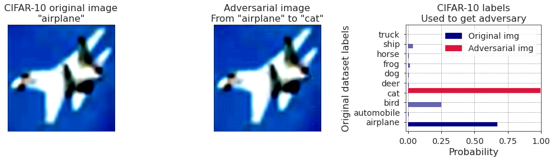
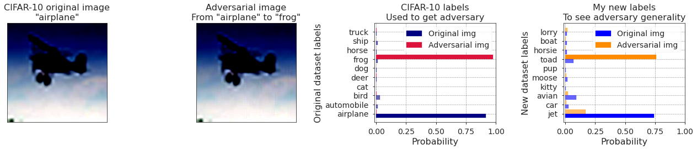
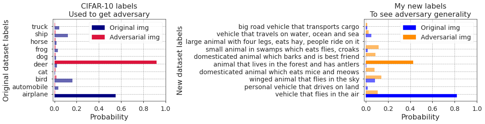

# Adversarial examples for the OpenAI CLIP in its zero-shot classification regime and their semantic generalization

## Stanislav Fort ([Twitter](https://twitter.com/stanislavfort) and [GitHub](https://github.com/stanislavfort))

**TL;DR: Adversarial examples are very easy to find for the [OpenAI CLIP model](https://openai.com/blog/clip/) in its zero-shot classification regime. Those adversarial examples generalize surprisingly well to semantically-related descriptions of the adversarial class. I wrote a [Google Colab](https://github.com/stanislavfort/OpenAI_CLIP_adversarial_examples/blob/main/OpenAI_CLIP_adversarial_images_playground.ipynb) where you can try it for yourself.**

## 1. Introduction 
Last week [OpenAI](https://openai.com/) has unveiled their new model called [CLIP](https://openai.com/blog/clip/) (Contrastive Language-Image Pretraining) nicely connecting the image and text modalities. Among other things, it seems capable of powerful zero-shot image classification like this: 1) encode an image, 2) encode text descriptions (such as "cat" or "bird") for potential classes of the image, 3) compare how well the image encoding matches the class description encodings, and 4) choose the argmax of that as the predicted label. In my experiment, this gives 87.37% test accuracy on [CIFAR-10](https://www.cs.toronto.edu/~kriz/cifar.html) (similar to a purpose trained ResNet20v1 without batch norm) without any additional finetuning, completely zero-shot and out of the box.

OpenAI has published their pretrained [CLIP on GitHub](https://github.com/openai/CLIP) and I couldn't resist having a look at it. The central questions I immediately started thinking about were:
1. Do adversarial examples exist for CLIP?
2. If they do exist, are they robust to changes in the class descriptions such as "dog" $\to$ "hound"?

I wrote a [Google Colab](https://github.com/stanislavfort/OpenAI_CLIP_adversarial_examples/blob/main/OpenAI_CLIP_adversarial_images_playground.ipynb) and started a [GitHub repository](https://github.com/stanislavfort/OpenAI_CLIP_adversarial_examples/) in which I 1) load the model and CIFAR-10, 2) run it in the zero-shot regime, 3) develop  **adversarial examples with minimal changes to the image**, and 4) show that they **generalize to semantically related descriptions** of the class towards which the adversary was optimized.

I hope the code could be helpful for others who might want to play with the model and see how well it works. As the CLIP implementation is in [PyTorch](https://pytorch.org/), so is my adversarial examples generation.

## 2. Getting adversarial examples for CIFAR-10 with CLIP

To see if there exist adversarial examples for CLIP, I first needed to specify a classification task. I started with CIFAR-10, which contains 10 classes: airplane, automobile, bird, cat, deer, dog, frog, horse, ship, truck. I then used the pretrained CLIP to classify each test set image to one of those 10 classes, matching the image encodings to the text encodings of the words "airplane", "automobile", "deer" etc. Even completely out of the box, I was already getting 87.37% test accuracy, which is decent and just a bit worse what I could get for a ResNet20v1 trained without a batch norm.

For a set of candidate class text descriptions (such as "cat" and "dog") $s_1, s_2,\dots, s_C$, where $C$ is the number of candidate classes, we encode each string $s_i$ into a text encoding $T_i = \mathrm{encoder}(s_i)$. For an image $X$, we get an encoding $I$ and the classification logits are then $z_i = \mathrm{distance}(I,T_i)$. To get probabilities out, we can apply $\mathrm{softmax}$ on top of the logit vector $\vec{z}$.

The classification task with CLIP therefore amounts to mapping an image $X$ and a set of candidate labels $\vec{s}$ to a probability vector as $f(X,\vec{s}) = \vec{p}$. To develop an adversarial example, we first choose, among the $C$ candidate labels, the target label $t$ towards which we will optimize the image. For that, we can use the cross entropy loss and calculate $\mathcal{L}(X,t,\vec{s}) = - \log \left ( f_t(X,\vec{s}) \right )$ which tells us how much unlike the target description $s_t$ our image looks like.

We now continue exactly as we would for any standard classifier. For an image $X$ we calculate the gradient of the loss $\mathcal{L}$ with respect to the image and get $g = \partial \mathcal{L}(X,t,\vec{s}) / \partial X$. With a particular learning rate (I chose $\eta$=0.1 at random and it works well enough, typically getting >90% of the adversarial class in <100 gradient steps), we gradually update $X := X - \eta g$ over many steps, until CLIP predicts the probability of class $t$ as high as we'd like.

(Perhaps) surprisingly, CLIP seems to have, at least on CIFAR-10, **some very easy to find and perceptually similar adversarial examples**. I found it generally very easy to flip a class to another.

## 3. CLIP adversarial examples generalize to related but different class descriptions
I wanted to know **how universal those adversarial examples are**. After all, zero-shot classification with CLIP is very different from the usual setup. To test generalization of adversarial examples to different text descriptions of the candidate classes, and especially very vague and indirect descriptions, I ran the following experiment.

I chose a set of class labels A, which could be "cat", "dog", "car" and so on. I then took an image $X$ labeled as class $c_1$ by CLIP, and developed an adversarial image $X^{\prime}$ that is close to $X$ in the pixel space but at the same time gets labeled confidently as another class $c_2$. The tuple $(X,X^{\prime})$ corresponds to the class change $(c_1,c_2)$ *given the class labels A*.

What if I used a different set of class names B, which would be semantically similar to a human (for example "cat" would go to "kitty", and "automobile" to "car"). Would the same pair of images $(X,X^{\prime})$ developed on the labels A work as an adversarial pair on the labels B? **The answer is, yes!**

Here is an example of an "airplane" adversarially modified to look like a "frog", which at the same time reads as a "toad" from among my modified class labels.

To make sure this point is clear, imagine the following: There is an image $X$ labeled a "cat" from among labels A = ("cat", "dog", "car", ...).  I develop an adversarial example $X^\prime$ that is labeled a "dog". From among an alternative set of labels B = ("kitty", "hound", "automobile") $X$ will now be labeled a "kitty" and its adversary $X^{\prime}$ would again be labeled a "hound". This shows that the adversarial examples **actually look like what they were optimized towards** even to a system as different from the usual classification paradigm as CLIP.

## 4. Generalization to very vague class names
To see how far this goes, I wanted to verify whether replacing "cat" with e.g. "a domesticated feline creature that eats mice and meows" and "dog" with e.g. "a four legged creature that barks" would still preserve the adversarial nature of an image developed on the original set of labels. **Even for very vague and descriptive class names the adversarial examples still generalize (albeit to a much lower extent).** To me this supports the hypothesis that the adversarial example actually looks like the broad concept of e.g. a dog to the classifier, rather than being a brittle quirk of the model.

Here's an example of such a generalization that you generate in my [Google Colab](https://github.com/stanislavfort/OpenAI_CLIP_adversarial_examples/blob/main/OpenAI_CLIP_adversarial_images_playground.ipynb). The image of an "airplane" is adversarially modified to read as a "deer". Among the more descriptive labels, the original image still reads as a "vehicle that flies in the air" while the adversary has generalized to the lengthy description of a deer as "animal that lives in the forest and has antlers".

## 5. Conclusion
It turns out that adversarial examples are very easy to find (<100 gradient steps typically) for the [OpenAI CLIP](https://openai.com/blog/clip/) model in the zero-shot classification regime. Those adversarial examples generalize to semantically related text descriptions of the adversarial class. For example, an image of a "cat" turned into a "jet" by an adversarial perturbation will also read as a "plane", and more surprisingly even as a "vehicle that flies in the air" to the model. To me this shows that the adversarial image actually **looks like the adversarial class** to the model and that it's not a peculiar consequence of the specific label (e.g. "jet"). The existence of adversarial examples in a model that is this far away from the usual classification paradigm is quite interesting to me, but it might not be unsurprising to others. If you'd like to regenerate my results in this post, or play with the model yourself, **I prepared a [Google Colab](https://github.com/stanislavfort/OpenAI_CLIP_adversarial_examples/blob/main/OpenAI_CLIP_adversarial_images_playground.ipynb) that you can run in <5 minutes on a free GPU.**

If you find this blogpost useful and would like to cite it, please use the following BibTeX:
> @misc{
>	Fort2021CLIPadversarial, 
>	title={Adversarial examples for the OpenAI CLIP in its zero-shot classification regime and their semantic generalization}, 
>	url={https://stanislavfort.github.io/2021/01/12/OpenAI_CLIP_adversarial_examples.html}, 
>	author={Stanislav Fort}, 
>	year={2021}, 
>	month={Jan} 
>} 
