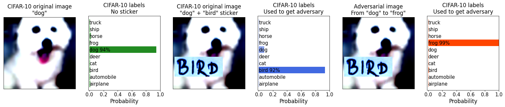
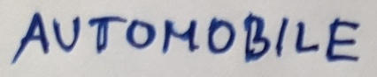
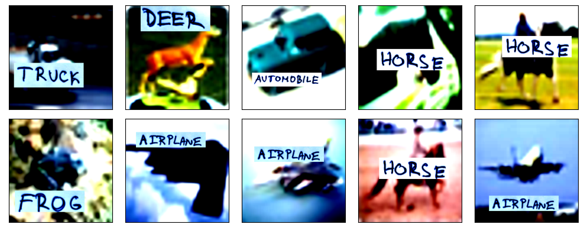
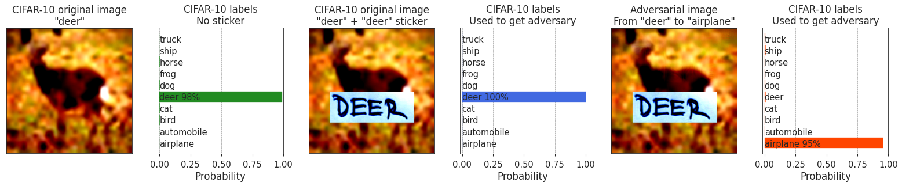
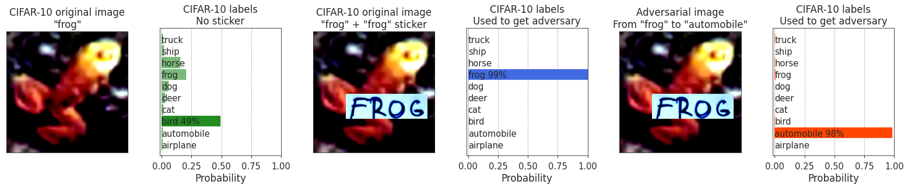
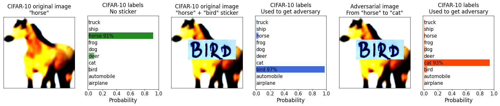
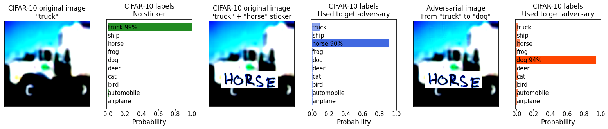
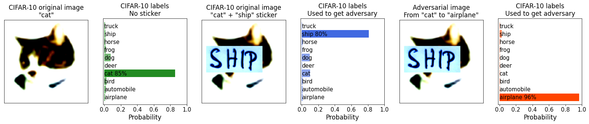
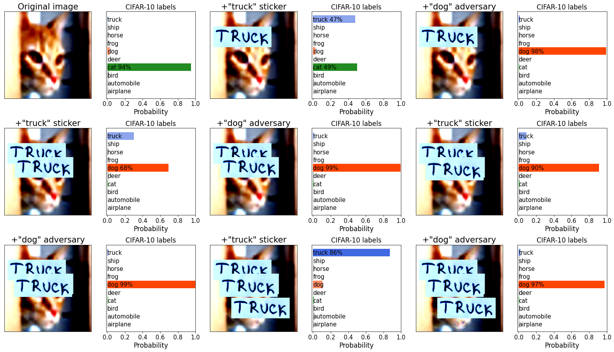
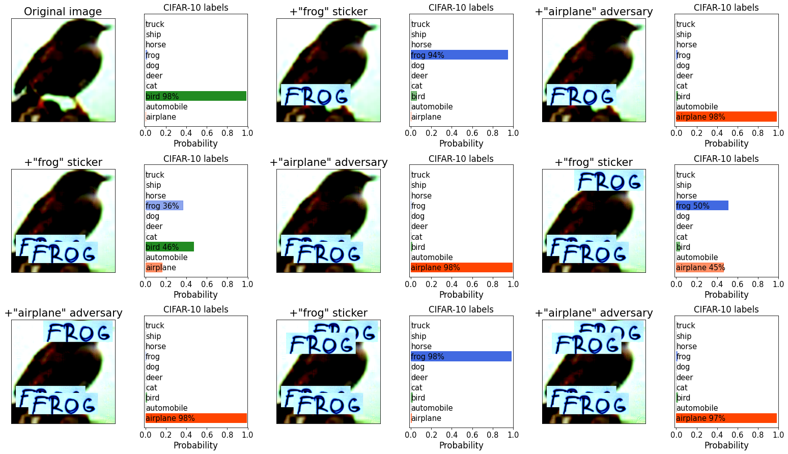

# Pixels still beat text: Attacking the OpenAI CLIP model with text patches and adversarial pixel perturbations

## Stanislav Fort ([Twitter](https://twitter.com/stanislavfort) and [GitHub](https://github.com/stanislavfort))



**TL;DR**: Adversarial examples are very easy to find for the [OpenAI CLIP model](https://openai.com/blog/clip/) in its zero-shot classification regime, as I demonstrated in [my last post](https://stanislavfort.github.io/2021/01/12/OpenAI_CLIP_adversarial_examples.html). Putting a sticker literally spelling **B I R D** on a picture of a dog will convince the classifier it is actually looking at a *bird*. This decision, however, can again be easily flipped to any other class (here *frog* in particular) by a targeted adversarial perturbation to the image pixels. Adding the label **B I R D** to a picture of a bird makes the classification easier, but it does not increase its robustness to pixel-level adversarial attacks. **I prepared a [Google Colab](https://github.com/stanislavfort/OpenAI_CLIP_adversarial_examples/blob/main/presentable_OpenAI_CLIP_stickers_and_adversaries.ipynb) that you can run in <5 minutes on a free GPU to replicate my results.**

## 1. Motivation

Two months ago [OpenAI](https://openai.com/) unveiled their new model called [CLIP](https://openai.com/blog/clip/) (Contrastive Language-Image Pretraining) nicely connecting the image and text modalities. Among other things, it is capable of powerful zero-shot image classification like this: 1) encode an image, 2) encode text descriptions (such as "cat" or "bird") for potential classes of the image, 3) compare how well the image encoding matches the class description encodings, and 4) choose the argmax of that as the predicted label.

In my [first blog post](https://stanislavfort.github.io/2021/01/12/OpenAI_CLIP_adversarial_examples.html) in this mini-series, I showed that CLIP **has adversarial examples which are very easy to find** in its zero-shot classification regime, and that those examples generalize surprisingly well to semantically-related descriptions of the adversarial class. I also wrote a [Google Colab](https://github.com/stanislavfort/OpenAI_CLIP_adversarial_examples/blob/main/OpenAI_CLIP_adversarial_images_playground.ipynb) where you can try it for yourself, and had an interesting [discussion about this](https://twitter.com/stanislavfort/status/1349394023010615296) on Twitter.

Two days ago, an [OpenAI blog post](https://openai.com/blog/multimodal-neurons/) demonstrated another really cool and in retrospect predictable (alas!) aspect of the model. Take an image of an object that CLIP would classify correctly, and put a piece of paper with the literal name of the class you want to turn it into written on it (e.g. **B I R D**). CLIP will now associate the image with the semantic class *bird*, despite the image actually not *looking* like a bird to a human. Some people rightly commented that adversarial examples suddenly became very easy to produce: slap a post-it note on the object of interest and you're done!

This got me thinking: are those actually adversarial examples? **Could I still change the class of the image by introducing pixel-level adversarial perturbation to the image with the sticker on it?** In addition, would the pixel-level perturbation be stronger than the sticker with e.g. **B I R D** written on it? The answer is **yes**. The traditional, pixel-level adversarial perturbation beats the text, and can easily flip the classification decision to any other class with imperceptibly small perturbations.

## 2. Getting adversarial examples for CIFAR-10 with CLIP

Using CLIP in its zero-shot classification regime is relatively straightforward and I go into more detail in my [previous post](https://stanislavfort.github.io/2021/01/12/OpenAI_CLIP_adversarial_examples.html). In short, you first encode the potential class text descriptions (such as "cat" and "dog"), and then compare image encodings to them and classify it based on the $\mathrm{argmax}$ of that. To create an adversarial example, you take the derivative of an element of the resulting probability vector that you would like to maximize with respect to the input image. You then iteratively change the image along the gradient direction, until the classification decision is flipped. (Perhaps) surprisingly to many, CLIP seems to have, at least on CIFAR-10, **some very easy to find and perceptually similar adversarial examples**. I found it generally very easy to flip a class to another.

## 3. Using hand-written class label stickers

Instead of getting e.g. a physical apple and putting a piece of paper over it saying **CAR** (the way they did in the [OpenAI blog post](https://openai.com/blog/multimodal-neurons/) with an apple and the word "iPod" on a post-it note), I hand-wrote the class names on a piece of paper, cropped them out, and saved them as individual [png files on my github](https://github.com/stanislavfort/OpenAI_CLIP_adversarial_examples/tree/main/stickers).

An example of my DIY "adversarial" sticker for the class *automobile*:



I pasted these stickers on CIFAR-10 images to verify that indeed CLIP will classify the image based on what's written on the sticker. Interestingly, while in my [previous post](https://stanislavfort.github.io/2021/01/12/OpenAI_CLIP_adversarial_examples.html) I reported 87.37% test accuracy on [CIFAR-10](https://www.cs.toronto.edu/~kriz/cifar.html) (similar to a purpose trained ResNet20v1 without batch norm) without any additional finetuning, completely zero-shot and out of the box, the test images + the sticker of the ground truth class plastered over it gives **100% test accuracy** (literally not a single mistake on the 10,000 CIFAR-10 test images)! This is without any finetuning at all, showing that CLIP is actually *really* good at reading the text in the image.

Here are some examples of the test set images + the corresponding class stickers plastered over them:



Here is an example of adding the ground truth class label sticker onto a test set image, increasing the already high probability of the correct class. Despite that, an adversarial perturbation (right column) can still change the class very easily.



In some cases, CLIP makes mistakes on the CIFAR-10 test set (to be precise, in 12.63% = 100% - 87.37% cases). Adding a sticker with the correct class always leads to the correct classification there. Here is an example of a frog being misclassified as a *bird* first, and then correctly classified as a *frog* after adding a sticker spelling out **F R O G** on it. Yet again, a small pixel-level adversarial perturbation easily changed the class to a confident *automobile*:



## 4. Class sticker versus adversarial pixel-level perturbation

The core question I tried to answer was this:
If I take an image that is correctly classified as class $c_1$, put a sticker of class $c_2$ on it, and then adversarially modify the resulting image towards class $c_3$, will the adversarial attack be successful?

As I reported above, I get 100% test accuracy on the CIFAR-10 test set when I add the ground truth class stickers on the images, suggesting that the classification task is now *way* easier. This could potentially mean that adversarial perturbations will be harder. This, however, did not prove to be the case. Flipping the image of class $c_1$ + a sticker of class $c_2$ to a different class $c_3$ is actually very easy.

Here are a few examples where an image is correctly classified as its true class (left column), a sticker changes the decision to whatever is written on it (middle column), and a pixel-level adversarial attack is able to overpower both and make the image into a different, third class (right column). The changes from the middle to the right column is really hard to see without subtracting the images, showcasing how small a modification was sufficient for the attack.

Example 1:


Example 2:


Example 3:


It is again very easy to flip the classification decision *even with the sticker*, which we might a priori assume would be harder given how much of a boost in test accuracy adding the relevant stickers made. This shows how ubiquitous adversarial vulnerabilities are.

## 5. Pixels beat text, beat pixels, beat text, ....

What if I try to reverse the pixel-level adversarial attack with *another* sticker? And what if then, I again try to generate an adversarial attack to *that* using a *new* pixel-level perturbation? And then, what if I use a sticker *again*?

In this experiment, I started with an original image that CLIP correctly classifies as e.g. a *cat* (Example 1). Putting a **T R U C K** sticker on it changes the decision partially to a *truck* (with some *cat* still lingering on). However, an adversarial attack towards *dog* easily turns the image into a convincing dog. As I repeat the operation (put a **T R U C K** sticker there, adversarially perturb towards *dog*), the classification decision seems to follow whatever the recent action was.

Example 1:


Example 2:


I was hoping that there would be more stability there, but it seems that whatever the number of stickers on the image, it's very easy to reverse it back towards the adversarial class by a new pixel-level attack.

## 6. Conclusion
Adversarial examples are very easy to find (<100 gradient steps typically) for the [OpenAI CLIP](https://openai.com/blog/clip/) model in its zero-shot classification regime, as shown in my [last post](https://stanislavfort.github.io/2021/01/12/OpenAI_CLIP_adversarial_examples.html). Putting a piece of text literally spelling out the name of the class I would like to change the image into typically convinces the network to flip its classification decision. In my opinion, however, this should not be viewed as a traditional adversarial attack. On the other hand, a traditional adversarial attack (small changes in pixels) is possible and as easy as before even with the class name sticker on the image. By producing a small adversarial perturbation, we can change the classification decision to any class we want, despite the presence of the text in the image. This is counterintuitive, since putting the correct class name sticker into test images increased test accuracy on CIFAR-10 from 87.37% to 100.00% without any finetuning at all, and we could expect more robustness to attacks to come with it. This demonstrates yet again that adversarial vulnerabilities are indeed really hard to get rid off and that they are ubiquitous in classifiers.

**I prepared a [Google Colab](https://github.com/stanislavfort/OpenAI_CLIP_adversarial_examples/blob/main/presentable_OpenAI_CLIP_stickers_and_adversaries.ipynb) that you can run in <5 minutes on a free GPU to replicate my results.**


If you find this blog post useful and would like to cite it, please use the following BibTeX:

```latex
@misc{
Fort2021CLIPadversarialstickers,
title={Pixels still beat text: Attacking the OpenAI CLIP model with text patches and adversarial pixel perturbations},
url={https://stanislavfort.github.io/2021/01/12/OpenAI_CLIP_stickers_and_adversarial_examples.html},
author={Stanislav Fort},
year={2021},
month={March}
}
```
